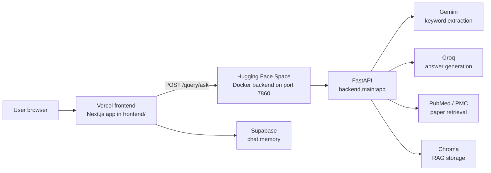

# MedInsight

MedInsight is split for deployment:

- Frontend: Vercel, using the `frontend/` Next.js app.
- Backend: Hugging Face Spaces, using the root `Dockerfile` and `backend.main:app`.

## Deployment Layout



## Backend on Hugging Face Spaces

Create a new Space with Docker as the SDK and push this repository. Hugging Face Spaces reads the YAML metadata block at the top of this README and the root `Dockerfile`.

Required Space metadata:

```yaml
---
title: MedInsight API
sdk: docker
app_port: 7860
---
```

The Docker container serves FastAPI on `0.0.0.0:7860`, which must match `app_port: 7860`.

Set these Space secrets:

- `GEMINI_API_KEY`
- `GROQ_API_KEY`
- `PUBMED_EMAIL`
- `PUBMED_API_KEY` if you have one
- `CHROMA_API_KEY`, `CHROMA_TENANT`, and `CHROMA_DATABASE` for Chroma Cloud

Optional backend variables are listed in `.env.example`.

Docker requirements used by the Space:

- Base image: `python:3.11-slim`
- Dependency file: `requirements.txt`
- Entrypoint: `uvicorn backend.main:app --host 0.0.0.0 --port 7860`
- Exposed port: `7860`
- Runtime Chroma path: `/tmp/medinsight-chroma`

After deploy, confirm:

```bash
curl https://your-backend-space.hf.space/health
```

Expected response:

```json
{"status":"ok"}
```

## Frontend on Vercel

Import this GitHub repository into Vercel. Either keep the repository root as the Vercel project root, or set the Vercel Root Directory to `frontend`. Both modes have a matching `vercel.json`.

Set these Vercel environment variables:

- `NEXT_PUBLIC_API_BASE_URL=https://your-backend-space.hf.space`
- `NEXT_PUBLIC_SUPABASE_URL`
- `NEXT_PUBLIC_SUPABASE_PUBLISHABLE_KEY`

Then deploy. The frontend build command is `npm run build` when the root directory is `frontend`, or `cd frontend && npm run build` from the repository root.

## Local Development

Backend:

```bash
pip install -r requirements.txt
uvicorn backend.main:app --host 127.0.0.1 --port 8000
```

Frontend:

```bash
cd frontend
npm install
npm run dev
```
